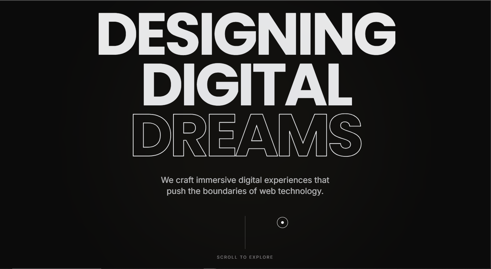

<p align="center">
  
</p>

<p align="center">
  
</p>

<p align="center">
  <a href="https://creative-agency-style.vercel.app/">
    
  </a>
</p>

<p align="center">
  <b>🌐 Live Demo:</b> https://creative-agency-style.vercel.app/
</p>

---

# 🚀 Project Overview
Creative Agency Style is a visually immersive, experimental web experience built to showcase modern UI/UX, advanced animations, and interactive design systems.  
Unlike traditional websites, this project is designed as a **digital experience**, emphasizing motion, depth, and user interaction.

It is ideal for:
- Creative portfolios
- Digital agencies
- Experimental UI showcases
- Premium frontend demonstrations
- Recruiter-facing portfolio projects

---

# ✨ Key Highlights
- 🎬 Cinematic storytelling layout
- 🧲 Custom magnetic cursor system
- 🌊 Ultra-smooth scrolling experience
- 🎨 Premium minimalist agency design
- ⚡ High-performance animations (60 FPS)
- 🧪 Experimental interaction section
- 📱 Fully responsive (mobile + desktop)
- 🏆 Portfolio-grade modern UI/UX

---

# 🧠 Core Features

## 🎬 Cinematic Entry Experience
- Smooth animated preloader
- Staggered text reveal animations
- Seamless transition into hero section
- Premium dark immersive aesthetic

## 🧲 Custom Magnetic Cursor (Signature Feature)
- Dynamic cursor with multiple states
- Magnetic attraction on interactive elements
- Cursor text reveal (Explore / View / Open)
- Smooth spring physics animation
- Blend mode glow effect for premium feel

## 🌊 Ultra-Smooth Scrolling System
- Powered by Lenis for buttery smooth scrolling
- Optimized for both desktop and mobile
- Scroll inertia for cinematic movement
- Seamless section transitions

## 🎞️ Advanced Parallax Animations
- GSAP-driven parallax effects
- Depth-based image movement
- Scroll-triggered scaling & reveals
- Cinematic visual layering

## 🖼️ Horizontal Scroll Showcase
- Unique horizontal scrolling gallery
- Smooth scroll direction transition
- Interactive project card animations
- Modern agency-style layout

## 🧪 Experimental Interaction Section
- Interactive particle canvas
- Mouse-follow animations
- Micro-interactions on hover
- Futuristic motion design elements

## 🎨 Premium UI/UX Design
- Minimal luxury color palette
- Large bold typography
- Glassmorphism accents
- Clean spacing & visual hierarchy

---

# 🛠️ Tech Stack

### ⚙️ Frontend
- **React 19 (Vite)** — Modern fast framework
- **Tailwind CSS v4** — Utility-first styling system

### 🎞️ Animation & Interaction
- **GSAP (GreenSock)** — Advanced scroll & motion animations
- **Framer Motion** — UI animations & transitions
- **Lenis** — Smooth scrolling engine

### 🎨 Design & Assets
- **Google Fonts** — Inter & Poppins
- **React Icons** — Modern scalable icons
- **Custom Cursor Engine** — Built from scratch

---

# 📸 Website Preview

## 🖥️ Full Screenshot


> Replace `./public/image.png` with your final homepage screenshot for best presentation.

---

# 📂 Project Structure
src/
├── components/ # Reusable UI components (Cursor, Preloader, Scroll)
├── sections/ # Main sections (Hero, About, Work, Experimental, Footer)
├── animations/ # GSAP & motion logic
├── assets/ # Images, media, and visual assets
├── App.jsx # Main application shell
├── main.jsx # Entry point
└── index.css # Global styles + Tailwind theme


---

# 🎨 Design System

## 🌈 Color Palette
| Role | Color |
|------|-------|
| Primary Background | #0B0B0B (Deep Black) |
| Secondary | #F5F5F5 (Soft White) |
| Accent | #C6A969 (Luxury Gold) |
| Neutral | #1A1A1A (Dark Grey) |

## 🔤 Typography
- Headings: **Poppins** (Bold, Oversized, Modern)
- Body Text: **Inter** (Clean, Minimal, Readable)
- Style: Large cinematic typography with strong spacing

---

# � Getting Started

## 📦 Installation
Clone the repository:
```bash
git clone https://github.com/your-username/creative-agency-style.git
cd creative-agency-style
```

### Install dependencies:
```bash
npm install
```

### Start the development server:
```bash
npm run dev
```

## 🏗️ Build for Production
To create an optimized production build:
```bash
npm run build
```

### Preview production build:
```bash
npm run preview
```

## 📱 Responsiveness & Performance
- Mobile-first responsive design
- Optimized animation performance
- Lazy loading for assets
- Smooth 60FPS animations
- Cross-browser compatibility (Chrome, Edge, Safari, Firefox)

## 🧩 Advanced Features (Portfolio Level)
- Custom animated cursor system
- Smooth parallax storytelling
- Micro-interactions across UI
- Horizontal scroll gallery
- Interactive canvas effects
- Cinematic section transitions
- Premium dark theme UI

🌍 **Live Website**  
🔗 https://creative-agency-style.vercel.app/

---

# 📜 License
This project is licensed under the MIT License.  
You are free to use, modify, and distribute with proper attribution.

👨‍💻 **Author**  
Navaneeth KV  
Frontend Developer | Creative UI Enthusiast

🌐 Portfolio: https://github.com/Navaneeth223  
💼 Focus: Modern UI, Animation, Experimental Web Experiences
